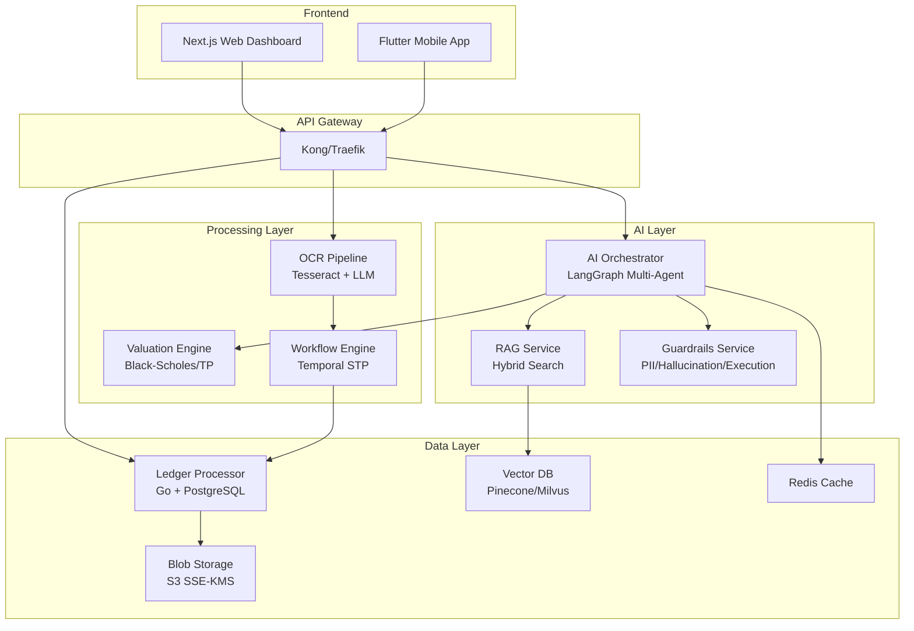

# AI-Native Accounting Platform

A hyper-automated, agentic accounting platform that scales Tier-1 accounting expertise using LLMs, Hybrid RAG, and deterministic workflow automation for Indian businesses.

## Architecture Overview



## Services

| Service | Technology | Port | Purpose |
|---------|-----------|------|---------|
| AI Orchestrator | Python FastAPI + LangGraph | 8000 | Multi-agent coordination, intent routing |
| RAG Service | Python FastAPI | 8000 | Hybrid dense+sparse retrieval, legal document search |
| Ledger Processor | Go + Gin | 8080 | High-throughput financial transaction processing |
| OCR Pipeline | Python FastAPI | 8000 | Document classification, extraction, validation |
| Guardrails Service | Python FastAPI | 8000 | PII detection, hallucination prevention, execution safety |
| Valuation Engine | Python FastAPI | 8000 | Black-Scholes, ESOP, transfer pricing calculations |
| Workflow Engine | Python + Temporal | 8000 | Straight-Through Processing orchestration |
| Notification Service | Python FastAPI | 8000 | Email, SMS, WhatsApp, push notifications |
| API Gateway | Kong | 8000 | Rate limiting, auth, routing, WAF |

## Quick Start

### Prerequisites
- Docker & Docker Compose
- kubectl & minikube (for K8s)
- Terraform (for AWS infra)
- Go 1.22+
- Python 3.11+
- Node.js 20+

### Local Development

```bash
# 1. Start infrastructure
cd infra/docker
docker-compose up -d postgres redis elasticsearch temporal

# 2. Run database migrations
psql -h localhost -U accounting -d accounting -f postgres/migrations/001_initial_schema.sql

# 3. Start backend services
# Terminal 1: AI Orchestrator
cd ai-orchestrator
pip install -r requirements.txt
uvicorn app.main:app --reload --port 8001

# Terminal 2: RAG Service
cd rag-service
pip install -r requirements.txt
uvicorn app.main:app --reload --port 8002

# Terminal 3: Ledger Processor
cd ledger-processor
go run cmd/server/main.go

# Terminal 4: OCR Pipeline
cd ocr-pipeline
pip install -r requirements.txt
uvicorn app.main:app --reload --port 8003

# Terminal 5: Guardrails Service
cd guardrails-service
pip install -r requirements.txt
uvicorn app.main:app --reload --port 8004

# Terminal 6: Valuation Engine
cd valuation-engine
pip install -r requirements.txt
uvicorn app.main:app --reload --port 8005

# Terminal 7: Workflow Worker
cd workflow-engine
pip install -r requirements.txt
python worker.py

# 4. Start frontend
cd web-dashboard
npm install
npm run dev
```

### Kubernetes Deployment

```bash
# Apply base manifests
kubectl apply -k infra/k8s/base/

# Verify deployments
kubectl get pods -n accounting-platform

# Port forward for local access
kubectl port-forward svc/ai-orchestrator 8001:8000 -n accounting-platform
```

### AWS Infrastructure (Terraform)

```bash
cd infra/terraform/aws
terraform init
terraform plan -var="environment=production"
terraform apply
```

## Compliance & Security

- **DPDP Act 2023**: Row-level security, PII tokenization, consent management
- **SOC 2 Type II**: Immutable audit logs, encryption at rest/transit, access controls
- **ISO 27001**: Key rotation, vulnerability scanning, WAF, network policies

## License

Proprietary - Accounting Platform Pvt Ltd
